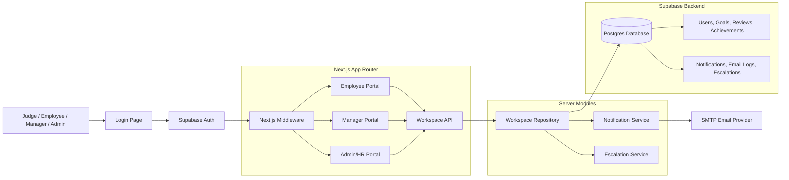
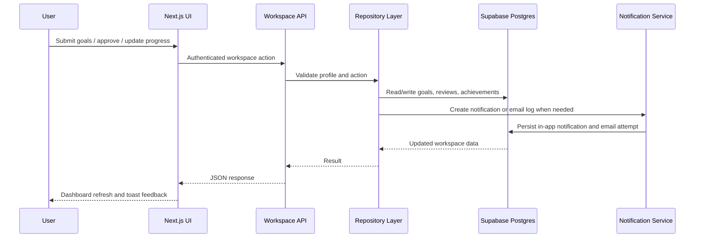
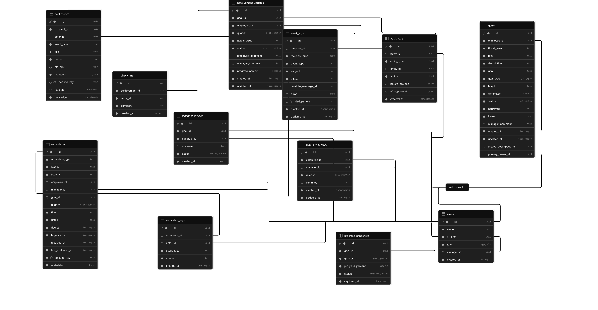

# GoalOS: Goal Setting & Tracking Portal


**Enterprise goal setting, approvals, quarterly progress tracking, and HR governance in one role-based portal.**

GoalOS is a hackathon-ready implementation of an in-house **Goal Setting & Tracking Portal** for enterprise teams. It solves a common organizational problem: goals are often scattered across spreadsheets, email threads, appraisal documents, and manager follow-ups, which creates poor visibility, weak accountability, delayed approvals, and manual performance review workflows.

This project brings the workflow into a secure SaaS-style application where employees define measurable goals, managers review and approve them, and Admin/HR teams monitor organizational goal health through analytics, notifications, and escalation governance.

---

## Hackathon Context

Built for **AtomQuest Hackathon 1.0** under the **In-House Goal Setting & Tracking Portal** challenge.

The solution aligns with the BRD/problem statement by covering:

- Structured employee goal creation with validation rules.
- Manager approval and rejection workflow.
- Role-based employee, manager, and Admin/HR access.
- Goal locking after approval.
- Quarterly check-ins with planned vs actual progress.
- Dashboards, analytics, notifications, and escalation visibility.

---

## Demo Accounts

The login page includes quick-fill demo buttons, and judges can also use these seeded accounts manually.

| Role | Email | Password | Suggested Test Journey |
| --- | --- | --- | --- |
| Employee | `employee@demo.com` | `Employee123` | Create goals, submit for approval, update quarterly achievements |
| Manager | `manager@demo.com` | `Manager123` | Review submitted goals, approve/reject, send check-in reminders |
| Admin/HR | `admin@demo.com` | `Admin123` | View organization analytics, unlock goals, sync/resolve escalations |

### How to Test

1. Open `/login`.
2. Select a quick login button or enter credentials manually.
3. Sign in with a seeded account.
4. The app redirects by role:

| Role | Redirect |
| --- | --- |
| Employee | `/employee` |
| Manager | `/manager` |
| Admin/HR | `/admin` |

---

## Feature Showcase

### Phase 1: Goal Setting & Approval

| Capability | Status | Implementation |
| --- | --- | --- |
| Goal Creation | ✅ Completed | Employees can create, edit, and delete draft goals. |
| Goal Approval Workflow | ✅ Completed | Managers can approve or reject submitted goals with comments. |
| Validation Rules | ✅ Completed | Max 8 goals, minimum 10% weightage per goal, exact 100% total before submission. |
| Role-based Access | ✅ Completed | Supabase Auth, route protection, and role-specific dashboards. |
| Goal Locking | ✅ Completed | Approved goals are locked and protected from normal employee edits. |
| Admin Controls | ✅ Completed | Admin/HR can view enterprise data and unlock approved goals when needed. |

### Phase 2: Tracking & Reviews

| Capability | Status | Implementation |
| --- | --- | --- |
| Quarterly Check-ins | ✅ Completed | Q1-Q4 achievement update flow for approved goals. |
| Planned vs Actual Tracking | ✅ Completed | Actual values are captured against approved targets. |
| Progress Calculations | ✅ Completed | Progress is calculated from UoM and Min/Max goal rules. |
| Goal Status Tracking | ✅ Completed | Draft, submitted, approved, rejected, locked, and progress status states. |
| Manager Reviews | ✅ Completed | Review records, comments, approval actions, and check-in visibility. |
| Dashboards & Analytics | ✅ Completed | KPI cards, charts, trends, status distribution, and team/org insights. |

### Bonus Features

| Capability | Status | Implementation |
| --- | --- | --- |
| Analytics Module | ✅ Completed | Role-aware analytics using goal, review, and achievement data. |
| Email Notifications | ✅ Completed | Workflow email delivery through Nodemailer/Gmail SMTP. |
| In-app Notifications | ✅ Completed | Notification bell with unread state and action links. |
| Modern Visualization Dashboards | ✅ Completed | Recharts-powered dashboard views and heatmaps. |
| Escalation Governance | ✅ Completed | Admin command center for delayed submissions, approvals, and check-ins. |

---

## Role-Based Workflows

### Employee

Employees use GoalOS to:

- Create up to 8 measurable goals.
- Assign thrust area, UoM, Min/Max target type, target value, and weightage.
- Validate that total goal weightage is exactly 100%.
- Submit goals to their manager for approval.
- Track quarterly achievement updates after goals are approved.
- View personal progress, goal health, and notifications.

### Manager

Managers use GoalOS to:

- See submitted goals from direct reports.
- Approve or reject goal sheets with manager comments.
- Review approved goal progress and quarterly check-ins.
- Send quarterly reminder notifications for pending updates.
- Analyze team progress, completion, approval load, and employee performance trends.

### Admin/HR

Admin/HR users use GoalOS to:

- Monitor organization-wide goal health.
- View analytics across employees, managers, departments, goal statuses, and check-ins.
- Unlock approved goals for controlled edits.
- Sync and resolve escalation items for delayed workflow actions.
- Maintain governance without manually chasing every stakeholder.

---

## Architecture

GoalOS follows a modular Next.js + Supabase architecture. The frontend renders role-aware dashboards, the Next.js API layer centralizes workspace actions, and Supabase stores authentication, users, goals, reviews, check-ins, notifications, and escalation records.



### Request Flow



### Core Data Model

The core schema is modeled directly in Supabase/PostgreSQL and includes auth-linked users, goals, manager reviews, achievement updates, check-ins, snapshots, notifications, email logs, audit logs, and escalation governance.



---

## Dashboard & Analytics Showcase

GoalOS includes role-aware analytics that help teams move from manual status tracking to actionable visibility.

| Analytics Area | What It Shows |
| --- | --- |
| KPI Cards | Total goals, weighted progress, check-in completion, pending approvals. |
| QoQ Analytics | Quarter-over-quarter achievement progress, completion rate, and check-in volume. |
| Progress Tracking | Weighted progress from approved goals and latest achievement updates. |
| Status Distribution | Draft, submitted, approved, rejected, locked, and unlocked goal health. |
| Organization Insights | Department-style goal distribution and thrust area breakdowns. |
| Manager Effectiveness | Team size, approval turnaround, check-in discipline, completion quality, and score. |
| Heatmaps | Employee quarterly activity matrix across Q1-Q4. |
| Export | Analytics rows can be exported as CSV for reporting. |

---

## Tech Stack

### Frontend

| Technology | Why It Was Chosen |
| --- | --- |
| Next.js App Router | Full-stack routing, server actions, API routes, middleware, and Vercel-friendly deployment. |
| TypeScript | Safer domain modeling for goals, roles, statuses, reviews, and achievement updates. |
| Tailwind CSS | Fast, consistent enterprise UI styling with responsive layouts. |
| shadcn/ui-style Components | Clean Radix-based primitives for buttons, cards, dialogs, inputs, selects, toasts, and labels. |
| Lucide React | Professional iconography for dashboard actions and workflow states. |

### Backend & Data

| Technology | Why It Was Chosen |
| --- | --- |
| Supabase Auth | Email/password authentication with session handling and route protection. |
| Supabase Postgres | Relational data model for users, goals, reviews, achievements, notifications, and escalations. |
| Row Level Security | Foundation for role-aware access patterns and protected workspace data. |
| Next.js API Routes | Centralized workspace actions between the UI and Supabase repository layer. |

### Visualization

| Technology | Why It Was Chosen |
| --- | --- |
| Recharts | Responsive charts for KPI dashboards, quarterly trends, distributions, and stacked views. |

### Notifications

| Technology | Why It Was Chosen |
| --- | --- |
| Nodemailer + Gmail SMTP | Implemented in this repo for hackathon-stable email notifications with minimal infrastructure. |
| In-app Notifications | Keeps workflow feedback available even if email credentials are not configured. |
| Resend | Recommended production email provider option; the current mailer boundary can be adapted to Resend for Vercel deployments. |

### Deployment

| Technology | Why It Was Chosen |
| --- | --- |
| Vercel | Natural hosting target for Next.js apps with environment variable management and preview deployments. |
| Supabase Cloud | Managed Auth and Postgres backend suitable for fast hackathon delivery and scalable iteration. |

---

## UI/UX Highlights

- Enterprise SaaS inspired dashboard layout.
- Responsive role-based pages for employee, manager, and Admin/HR workflows.
- Professional cards, KPI sections, tables, charts, status badges, and notification patterns.
- Demo-friendly login page with visible seeded credentials and quick-fill buttons.
- Clean workflow feedback through toasts, disabled loading states, validation messages, and protected routes.

---

## Local Setup

### Prerequisites

- Node.js 20+
- npm
- Supabase project
- Gmail app password for email notifications, optional for demo stability

### Install Dependencies

```bash
npm install
```

### Environment Variables

Create `.env.local` in the project root:

```bash
NEXT_PUBLIC_SUPABASE_URL=https://your-project-ref.supabase.co
NEXT_PUBLIC_SUPABASE_ANON_KEY=your-anon-key
SUPABASE_SERVICE_ROLE_KEY=your-service-role-key
NEXT_PUBLIC_APP_URL=http://localhost:3000

# Optional email delivery for workflow notifications
SMTP_EMAIL=your-gmail-address@gmail.com
SMTP_PASSWORD=your-gmail-app-password
```

Important:

- `SUPABASE_SERVICE_ROLE_KEY` is used by the local seed script and server-side notification logging.
- Never expose the service role key with a `NEXT_PUBLIC_` prefix.
- If SMTP variables are missing, in-app notifications still work and email attempts are safely skipped/logged.

### Supabase Setup

1. Create a Supabase project.
2. Open the Supabase SQL Editor.
3. Run the full contents of `supabase/schema.sql`.
4. Confirm the schema includes tables such as `users`, `goals`, `manager_reviews`, `achievement_updates`, `notifications`, `email_logs`, and `escalations`.
5. Seed demo accounts and workspace data:

```bash
npm run db:seed
```

### Run Locally

```bash
npm run dev
```

Open:

```txt
http://localhost:3000/login
```

### Quality Checks

```bash
npm run lint
npm run typecheck
npm run build
```

### Deployment

Recommended deployment path:

1. Push the repository to GitHub.
2. Import the project into Vercel.
3. Add the same environment variables in Vercel Project Settings.
4. Keep Supabase Auth redirect URLs aligned with the deployed app URL.
5. Run `supabase/schema.sql` and `npm run db:seed` against the intended Supabase project.
6. Deploy.

---

## Project Structure

```txt
.
├── app/
│   ├── api/workspace/          # Authenticated workspace API route
│   ├── employee/               # Employee dashboard route
│   ├── manager/                # Manager dashboard route
│   ├── admin/                  # Admin/HR dashboard route
│   └── login/                  # Login page, demo accounts, auth actions
├── components/
│   ├── dashboard/              # Goal portal, achievement tracking, analytics dashboard
│   ├── escalations/            # Admin escalation command center
│   ├── goals/                  # Goal form dialog
│   ├── notifications/          # In-app notification menu
│   └── ui/                     # Reusable UI primitives
├── lib/
│   ├── domain/                 # Goal validation, progress, analytics, shared types
│   ├── escalations/            # Escalation rules and resolution service
│   ├── notifications/          # Notification service, templates, mailer
│   ├── services/               # API client and Supabase repository
│   └── supabase/               # Supabase clients, config, middleware helpers
├── scripts/
│   └── seed-demo-accounts.mjs  # Seeded hackathon users and demo data
└── supabase/
    └── schema.sql              # Database schema, indexes, policies, triggers
```

---

## Hackathon Alignment

| Problem Statement Requirement | Status | Notes |
| --- | --- | --- |
| Employee goal creation | ✅ Completed | Draft goal CRUD with structured fields. |
| Goal validation | ✅ Completed | Max count, minimum weightage, and total 100% checks. |
| Manager approval workflow | ✅ Completed | Submit, approve, reject, comments, and notifications. |
| Role-based portals | ✅ Completed | Employee, Manager, Admin/HR routes and redirects. |
| Goal locking after approval | ✅ Completed | Approved goals become locked. |
| Admin unlock/governance | ✅ Completed | Admin can unlock and monitor escalations. |
| Quarterly check-ins | ✅ Completed | Q1-Q4 progress update workflow. |
| Planned vs actual tracking | ✅ Completed | Actual values captured and progress calculated. |
| Analytics dashboards | ✅ Completed | KPI cards, charts, trends, distributions, and heatmaps. |
| Email notifications | ✅ Completed | SMTP-based email workflow with in-app fallback. |
| Microsoft Entra ID | ❌ Pending | Listed as a production future improvement. |
| Teams integration | ❌ Pending | Listed as a production future improvement. |
| Automated scheduled escalation jobs | ⚠️ Partial | Escalation rules exist; sync is admin-triggered rather than cron/queue based. |

---

## Future Improvements

- Microsoft Entra ID / Azure AD SSO for enterprise identity.
- Microsoft Teams integration for approval reminders and check-in nudges.
- Advanced escalation engine with scheduled jobs, SLA rules, and audit workflows.
- AI insights for goal quality, risk prediction, and personalized performance recommendations.
- More granular RBAC policies and department-level reporting filters.
- Resend or another transactional email provider for production-grade email delivery.
- CSV/PDF appraisal exports and HRIS integration.

---

## Notes for Judges

- The app is designed to be tested quickly through the three demo accounts.
- The login page displays all seeded credentials and quick-fill login buttons.
- The database seed creates users, goals, reviews, achievements, and demo analytics data.
- Email credentials are optional; the demo remains functional through in-app notifications even without SMTP setup.
- The implementation avoids mock localStorage data and reads workspace records from Supabase through the Next.js API layer.
