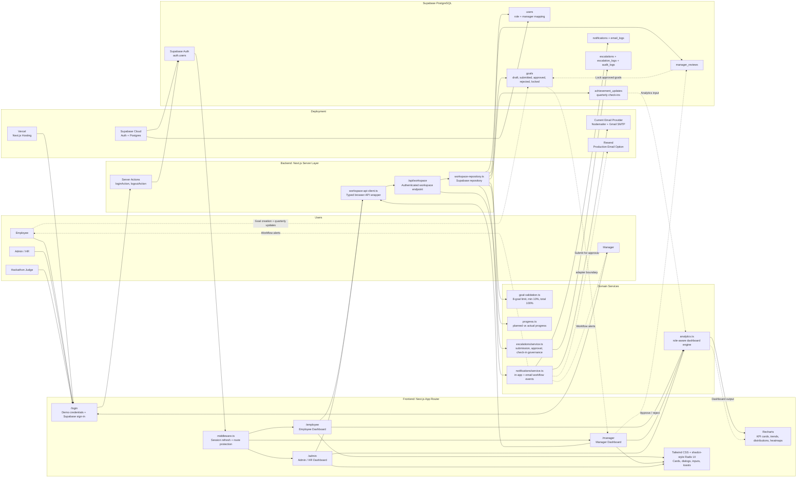

# AtomQuest Hackathon 1.0 Submission

## Project Name

**GoalOS: In-House Goal Setting & Tracking Portal**

## Project Overview

GoalOS is an enterprise-style goal management portal built for the AtomQuest Hackathon 1.0 **In-House Goal Setting & Tracking Portal** challenge. It replaces fragmented spreadsheets, email approvals, and manual appraisal follow-ups with one role-based system for goal creation, manager approval, quarterly check-ins, analytics, notifications, and HR governance.

The product is designed for three core roles:

- **Employee:** creates measurable goals and updates quarterly progress.
- **Manager:** reviews submitted goals, approves or rejects goal sheets, and monitors team progress.
- **Admin/HR:** views organization-wide analytics, unlocks approved goals when required, and manages escalations.

## Links

| Resource | URL |
| --- | --- |
| Working Demo | https://in-house-goal-setting-and-tracking.vercel.app/ |
| GitHub Repository | https://github.com/priyanshjain117/In-House-Goal-Setting-and-Tracking-Portal |

## Architecture Diagram

This diagram is based on the implemented Next.js, Supabase, dashboard, analytics, notification, and escalation modules in the repository.

## Core Data Model

The project uses Supabase PostgreSQL tables for users, goals, manager reviews, achievement updates, quarterly reviews, check-ins, progress snapshots, notifications, email logs, audit logs, and escalation governance.

## Architecture Analysis

### Frontend Architecture

The frontend uses **Next.js App Router** with role-specific routes:

- `/login` renders the demo-friendly login screen and calls the login server action.
- `/employee`, `/manager`, and `/admin` each call `requireProfile(role)` before rendering `GoalPortal`.
- `GoalPortal` is the central dashboard shell. It loads workspace data, manages local UI state, and delegates features to goal forms, achievement tracking, analytics, notification menu, and escalation components.

Styling is built with **Tailwind CSS** and shadcn-style Radix UI primitives. Visual analytics are rendered with **Recharts**.

### Authentication and Role-Based Access

Authentication uses **Supabase Auth** with email/password login.

- `loginAction` signs in through `supabase.auth.signInWithPassword`.
- After login, the app reads the role from `public.users`.
- `middleware.ts` refreshes Supabase sessions and protects `/employee`, `/manager`, and `/admin`.
- `requireProfile(role)` enforces server-side role checks before dashboard rendering.
- Users are redirected to their correct home route if they try to access another role's dashboard.

### Backend and Service Layer

The app uses a single authenticated workspace API route:

- `GET /api/workspace` loads users, goals, reviews, achievements, notifications, and escalations.
- `POST /api/workspace` dispatches actions such as goal creation, submission, approval, notifications, achievement updates, unlocks, and escalation syncs.
- `workspace-api-client.ts` provides typed browser-side functions.
- `workspace-repository.ts` is the server-side Supabase repository.

This keeps dashboard components clean while centralizing database operations and workflow side effects.

### Supabase Integration

Supabase provides:

- Auth sessions through `@supabase/ssr`.
- PostgreSQL persistence for workflow and analytics data.
- Role and manager mapping through the `users` table.
- RLS-ready schema, indexes, triggers, and enum-backed workflow states.
- Seeded demo users and workspace records through `scripts/seed-demo-accounts.mjs`.

### Dashboard and Analytics System

Dashboard analytics are generated from real workspace data in `lib/domain/analytics.ts`.

The analytics engine computes:

- Total goals, approved goals, pending approvals, locked/unlocked counts.
- Weighted progress from approved goals and achievement updates.
- Check-in completion rates.
- Quarterly progress and completion trends.
- Goal status, UoM, goal type, thrust area, and department-style distributions.
- Employee progress rows and quarterly heatmaps.
- Manager effectiveness score based on approval turnaround, check-ins, and completion quality.

`VisualDashboard` turns these analytics into KPI cards, charts, tables, heatmaps, and CSV export.

### Notification Module

Notifications are triggered by workflow events:

- Employee submits goals -> manager receives a goal submission notification.
- Manager approves goals -> employee receives approval notification.
- Manager rejects goals -> employee receives rework notification.
- Manager/Admin sends quarterly reminders -> employees with pending check-ins receive reminders.
- Escalation sync can notify relevant stakeholders.

The implementation stores in-app notifications in `notifications` and email attempts in `email_logs`. The current email implementation uses **Nodemailer + Gmail SMTP**. The architecture keeps this behind `notifications/service.ts`, so a production provider such as **Resend** can replace the mail transport without changing dashboard workflow code.

### Deployment Architecture

- **Vercel** hosts the Next.js application.
- **Supabase Cloud** hosts Auth and PostgreSQL.
- Environment variables configure Supabase URL, anon key, service role key, app URL, and SMTP credentials.
- Resend is a recommended production email provider option; the current repository implementation uses SMTP through Nodemailer.

## Tech Stack

| Layer | Technology | Purpose |
| --- | --- | --- |
| Frontend | Next.js App Router, React 19, TypeScript | Role-based dashboards and server/client app architecture |
| Styling | Tailwind CSS, shadcn-style Radix UI, Lucide React | Professional enterprise SaaS UI |
| Charts | Recharts | KPI cards, trends, distributions, heatmaps, dashboard analytics |
| Auth | Supabase Auth, `@supabase/ssr` | Email/password login, session cookies, protected routes |
| Backend | Next.js API routes, server actions | Auth actions and workspace workflow API |
| Database | Supabase PostgreSQL | Goals, users, reviews, achievements, notifications, escalations |
| Notifications | Nodemailer + Gmail SMTP, in-app notification tables | Workflow alerts and email logging |
| Deployment | Vercel + Supabase Cloud | Hosted Next.js frontend and managed backend |

## Key Features

- Goal creation, editing, deletion, and submission.
- Validation rules: max 8 goals, minimum 10% per goal, exactly 100% total weightage.
- Manager approval/rejection workflow with comments.
- Goal locking after approval.
- Admin/HR unlock controls.
- Quarterly check-ins with planned vs actual progress.
- Progress calculation for numeric, percentage, timeline, and zero-based goals.
- Role-based dashboards for Employee, Manager, and Admin/HR.
- Analytics dashboard with KPIs, QoQ trends, status distributions, heatmaps, manager effectiveness, and CSV export.
- In-app notifications and email notification logs.
- Escalation governance for delayed submissions, approvals, and check-ins.

## Implemented Phases

| Phase | Status | Implemented Scope |
| --- | --- | --- |
| Phase 1: Goal Setting | Completed | Goal CRUD, validation rules, submission, approval/rejection, role-based access, goal locking, admin unlock |
| Phase 2: Tracking | Completed | Quarterly check-ins, planned vs actual tracking, progress calculations, manager comments, dashboards |
| Bonus: Analytics | Completed | Role-aware KPIs, QoQ trends, distributions, heatmaps, manager effectiveness, CSV export |
| Bonus: Notifications | Completed | In-app notifications, email attempts, workflow templates, dedupe keys, reminder flow |
| Bonus: Governance | Completed | Admin escalation sync, escalation dashboard, manual resolution, escalation logs |

## Demo Accounts

| Role | Email | Password | What to Test |
| --- | --- | --- | --- |
| Employee | `employee@demo.com` | `Employee123` | Goal creation, validation, submission, quarterly updates |
| Manager | `manager@demo.com` | `Manager123` | Goal review, approval/rejection, team analytics, reminders |
| Admin/HR | `admin@demo.com` | `Admin123` | Organization analytics, goal unlock, escalation governance |

## Workflow Explanation

### Employee Workflow

1. Employee logs in and lands on `/employee`.
2. Employee creates measurable goals with thrust area, UoM, goal type, target, and weightage.
3. Validation ensures goals are complete and total weightage is exactly 100%.
4. Employee submits goals for approval.
5. After approval, goals are locked and become available for quarterly achievement tracking.
6. Employee updates planned vs actual progress and sees personal analytics.

### Manager Workflow

1. Manager logs in and lands on `/manager`.
2. Manager views submitted goals from direct reports.
3. Manager approves or rejects submitted goals with comments.
4. Approval locks goals; rejection returns them for employee rework.
5. Manager monitors team progress, pending approvals, check-ins, and completion trends.
6. Manager can send quarterly check-in reminders.

### Admin/HR Workflow

1. Admin/HR logs in and lands on `/admin`.
2. Admin views organization-level goal, review, check-in, and progress analytics.
3. Admin can unlock approved goals when governance requires controlled edits.
4. Admin can sync escalation rules for delayed submissions, approvals, and check-ins.
5. Admin reviews and resolves escalation items from the governance console.

## Hackathon Alignment

| Requirement Area | Alignment |
| --- | --- |
| Phase 1 Goal Creation | Employees can create, edit, validate, delete, and submit goals. |
| Phase 1 Approval Workflow | Managers can approve/reject submitted goals with comments. |
| Phase 1 Role Access | Supabase Auth, protected routes, and role-based dashboards are implemented. |
| Phase 1 Goal Locking | Approved goals are locked, and Admin/HR can unlock when needed. |
| Phase 2 Check-ins | Approved goals support quarterly achievement updates. |
| Phase 2 Planned vs Actual | Actual values are captured and converted into calculated progress. |
| Phase 2 Dashboards | Employee, Manager, and Admin dashboards show role-specific analytics. |
| Bonus Analytics | Dedicated analytics module powers KPIs, charts, heatmaps, and manager effectiveness. |
| Bonus Notifications | In-app notifications and email workflow logging are implemented. |
| Bonus Governance | Escalation service and Admin escalation dashboard are implemented. |

## 30-Second Judge Summary

GoalOS is a working enterprise goal workflow system with Supabase authentication, role-based dashboards, goal validation, manager approvals, locked approved goals, quarterly progress tracking, analytics dashboards, notifications, and HR escalation governance. It is deployed on Vercel, backed by Supabase PostgreSQL, and seeded with demo accounts so judges can test Employee, Manager, and Admin/HR journeys immediately.

